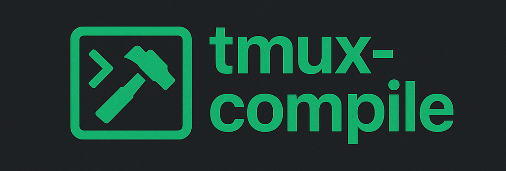
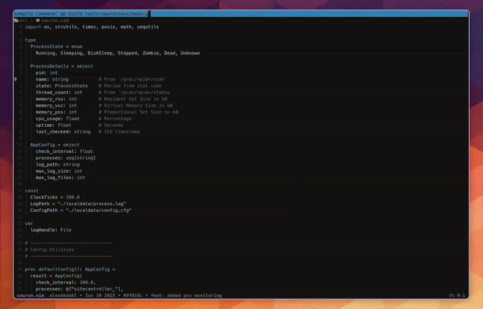

<p align="center">
  
</p>
<p align="center">
    <b>Seamless compilation workflows from inside tmux</b>
</p>

`tmux-compile` is inspired by Emacs’ compile-mode: it runs build commands in a dedicated pane, keeps a history of previous commands and lets you jump straight to errors in your editor. The goal is to simplify repetitive compilation tasks without pulling you out of your terminal or editor.

## Why use tmux-compile?

Modern terminal workflows often juggle editors, build scripts and error messages. `tmux-compile` keeps everything together:

<p align="center">
  
</p>

- **Stay in tmux** – run compilations without spawning external windows or switching panes manually.
- **Smart error jumping** – if Neovim is running in an adjacent pane, you can jump directly to the file and line reported by your compiler. No more copying file paths.
- **Minimal friction** – choose your own keybindings and pane height; history is persisted per session or globally.
- **Inspired by compile-mode** – familiar to users of Emacs, but adapted to the tmux + Neovim workflow.

## Features

- **Dedicated compile pane** – open a separate pane for running arbitrary shell commands.
- **Persistent history** – saves each compile command you run; optionally one history file per tmux session.
- **Error parsing and navigation** – detects errors of the form `file:line:col` or `file:line` and opens the file in Neovim.
- **Configurable** – choose keybindings for triggering, re-running or killing the compile pane; adjust the pane height and history location.
- **Timestamped, syntax-highlighted output** – makes it easier to follow long build outputs.

## Requirements

- **tmux ≥ 2.0**
- **Neovim** (only needed for the error navigation feature)
- **bash**

## Installation

### With tpm

Add the plugin to your `tmux.conf`:

```tmux
set -g @plugin 'alexekdahl/tmux-compile'
```

Reload TPM with `<prefix> + I` to fetch and install the plugin.

### Manual installation

Clone the repository into your tmux plugin directory and source it:

```bash
git clone https://github.com/alexekdahl/tmux-compile ~/.tmux/plugins/tmux-compile
```

Then add this to your `tmux.conf`:

```tmux
run-shell ~/.tmux/plugins/tmux-compile/compile-mode.tmux
```

## Usage

By default the plugin defines a few keybindings. You can change them under **Configuration**. In the following table `<prefix>` refers to your tmux prefix key (often `C-b`).

| Action               | Default keybinding |
|---------------------|--------------------|
| Run compile command   | `<prefix> C-b`       |
| Re-run last command | `<prefix> C-r`       |
| Kill compile pane   | `<prefix> C-k`       |
| Open file at error  | `Enter` in copy-mode |

When you first trigger the compile pane you will be prompted for a shell command. After execution the command is stored in the history so you can re-run it quickly. While viewing the output in copy-mode, pressing **Enter** on a line that looks like `file:line:col` (or `file:line`) opens that file at the specified location in Neovim. Neovim must be running in another pane for this feature to work.

### Command history

`tmux-compile` writes the commands you run to a history file. By default all sessions share a single file, but you can enable per-session history. With session-aware history enabled, each tmux session has its own file named after the session, stored in the directory given by `@compile-mode-history-dir`.

## Configuration

All options are set in `tmux.conf` using `set -g`. Example:

```tmux
# Trigger the compile prompt (default: <prefix> b)
set -g @compile-mode-key "C-b"

# Re-run the last compile command (default: <prefix> r)
set -g @compile-mode-recompile-key "C-r"

# Kill the compile pane (default: <prefix> k)
set -g @compile-mode-kill-key "C-k"

# Height of the compile pane (e.g. 25%, 10 for lines)
set -g @compile-mode-height "35%"

# File used to store command history
set -g @compile-mode-history-file "$HOME/.compile-history"

# Enable per-session history (on/off)
set -g @compile-mode-session-history "off"

# Base directory for per-session history files
set -g @compile-mode-history-dir "$HOME/.compile-history-dir"

# Key to open files from compiler errors while in copy-mode
set -g @compile-mode-open-file-key "Enter"
```

## Error navigation

When viewing the compile output in copy-mode, move the cursor to a line containing a compiler error (formatted as `path/to/file:line:col` or `path/to/file:line`) and press the key configured via `@compile-mode-open-file-key`. `tmux-compile` extracts the file path and line number and opens that location in Neovim. Make sure Neovim is running in another tmux pane so it can receive the command.

## Contributing & development

Contributions are welcome! Feel free to open issues or pull requests on GitHub if you find bugs or have ideas for improvements. To hack on the plugin locally, clone the repository and source the script from your `tmux.conf`. There are no external dependencies besides tmux and bash. Keeping your changes simple and well-documented will make it easier to review and merge.

## License

`tmux-compile` is distributed under the MIT License. See the LICENSE file for details.
